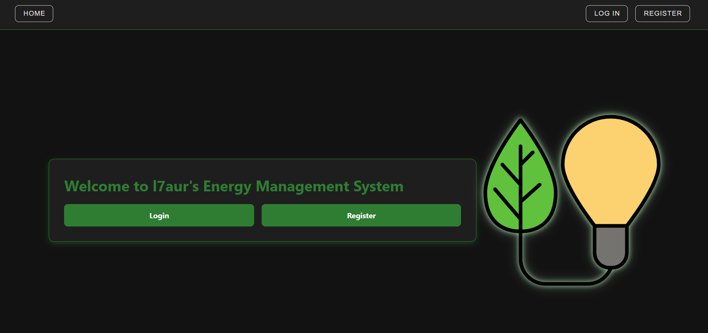
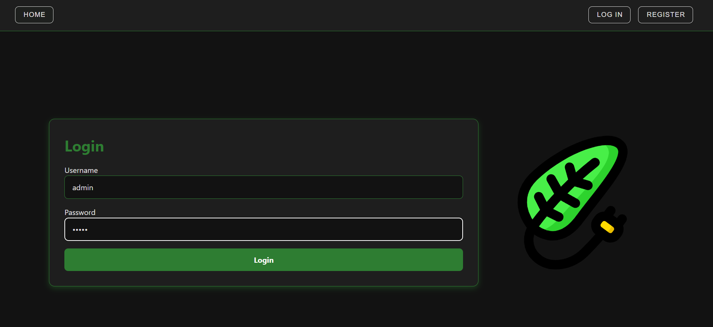
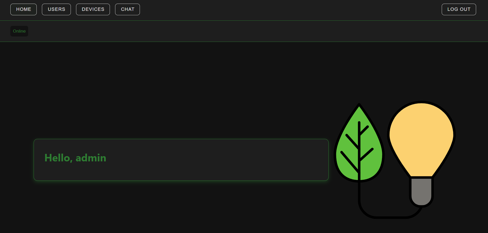
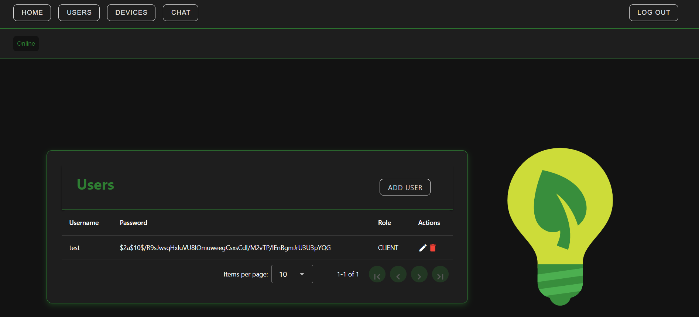
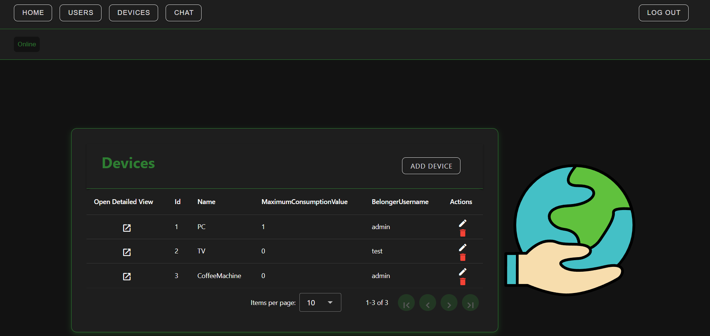
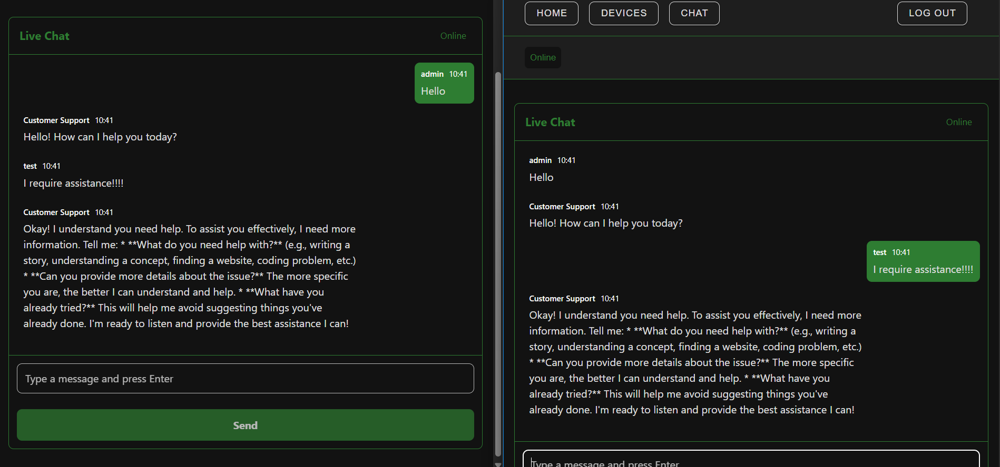
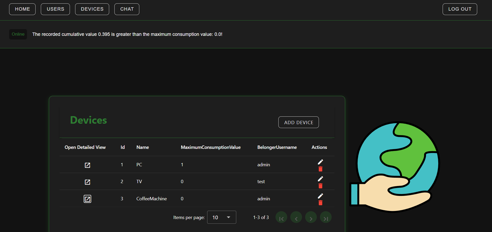
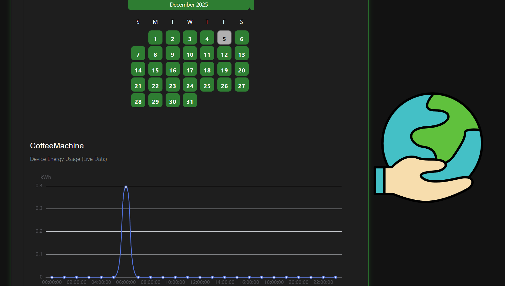

# Energy Management Frontend — Vue.js

The frontend of the **Energy Management application** is built with **Vue.js 3** and **Vite**.  
It provides the user interface for interacting with the microservices (Authentication, User, Device) via the **API Gateway**.

This project is **publicly accessible** but communicates exclusively with internal microservices through the API Gateway.

## Features

- User authentication via JWT (handled through Auth microservice)
- Role-based access control (RBAC)
- Display and management of user profiles
- Device listing and user-device association
- Integration with REST APIs via Axios
- Responsive UI with reusable components
- Routing using Vue Router
- State management via Pinia
- Development and production builds with Vite
- Docker container support

## Tech Stack

| Component        | Technology     |
| ---------------- | -------------- |
| Language         | TypeScript     |
| Framework        | Vue.js 3       |
| Build Tool       | Vite           |
| State Management | Pinia          |
| Router           | Vue Router 4   |
| HTTP Client      | Axios          |
| Styling          | CSS            |
| Container        | Docker         |
| Deployment       | Docker Compose |

## Architecture

- **Direct REST communication**: Each frontend view or component directly calls the appropriate backend service endpoints (Authentication, User, Device) via REST APIs.
- **No messaging queue in the backend**: Since the backend microservices do not use a message broker, the frontend ensures data consistency by performing multiple API requests when needed.
- **Data consistency strategy**:
  - For user-related views, the frontend may request user profile data from the User service and authentication info from the Auth service in separate calls.
  - For device management, the frontend may fetch device details and associated user information in separate API requests to guarantee the UI reflects the most recent state.
- **Stateless backend services**: All microservices are stateless; the frontend is responsible for aggregating and presenting consistent data to the user.
- **JWT-based authentication**: Tokens are validated at the API Gateway layer, and the frontend includes JWT tokens in all requests to secure endpoints.
- **Internal service boundaries**: The frontend does not communicate directly with backend databases or internal networks; all requests go through the API Gateway.

This architecture allows the frontend to maintain a single source of truth for UI state while working with stateless microservices, compensating for the lack of backend message propagation or event-driven updates.

## How to Use

Follow these steps to run the Energy Management frontend locally or with Docker.

### Development

1. Clone the repository
2. Install dependencies
3. Run development server

### Run with docker-compose

The `docker-compose.yml` file is provided in the repository.

```bash
docker-compose up --build
```
## Screenshots















